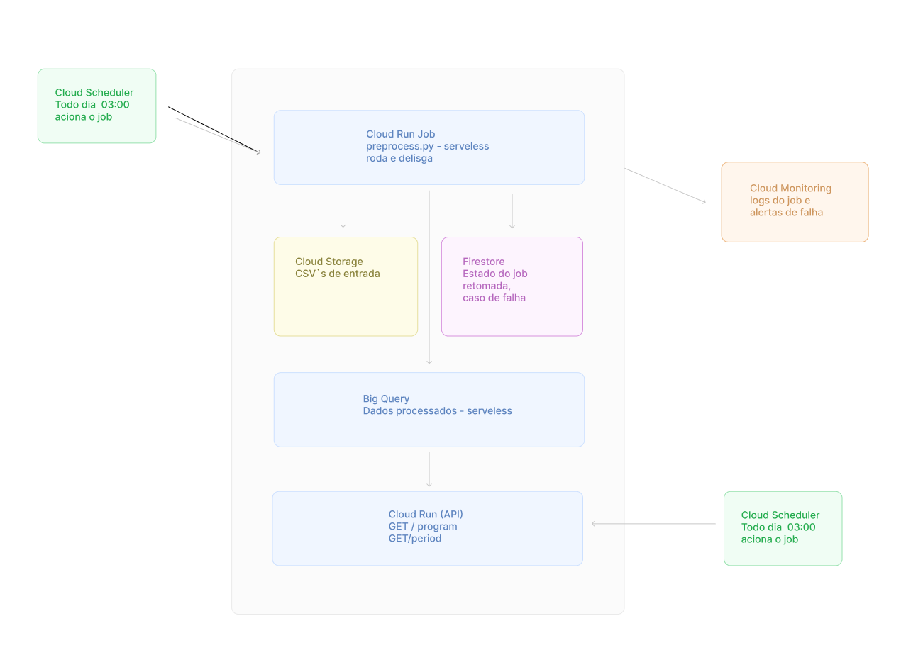

# Arquitetura em nuvem — GCP

## Visão geral

A solução é composta por dois subsistemas independentes:

1. **Pipeline de dados** — job diário que lê os CSVs brutos, executa o
   pré-processamento e grava o resultado no banco de dados.
2. **REST API** — serviço sempre disponível que consulta os dados processados
   e responde às requisições do algoritmo de otimização.

---

## Diagrama



---

## Serviços utilizados e justificativas

### Cloud Scheduler

**Propósito:** dispara eventos em horários programados (cron).

**Motivo:** é o equivalente gerenciado do crontab no GCP.
Não requer infraestrutura própria, é serverless e tem integração nativa com
Cloud Run Jobs. Configurado para acionar o job de pré-processamento uma vez
por dia (ex: 03:00).


---

### Cloud Run Jobs

**Propósito:** executa um container até a conclusão e para. Diferente do
Cloud Run Service, não fica no ar aguardando requests — sobe, processa e
desliga.

**Motivo:** atende diretamente ao requisito de que o sistema
não precisa ficar ligado o restante do tempo. É serverless, paga apenas pelo
tempo de execução e escala automaticamente.

---

### Cloud Storage (GCS)

**Propósito:** armazenamento de objetos (arquivos).

**Motivo:** é usado com dois propósitos:

1. **Fonte dos dados brutos** — os arquivos `tvaberta_inventory_availability.csv`
   e `tvaberta_program_audience.csv` ficam armazenados em um bucket e são
   consumidos pelo Cloud Run Job a cada execução.
2. **Checkpoint de estado** — ao final de cada etapa do processamento, o job
   grava um arquivo de controle no GCS registrando o progresso. Se o job
   falhar no meio do processo, na próxima execução ele lê o checkpoint e
   retoma de onde parou, sem reprocessar o que já foi concluído.

---

### Firestore

**Propósito:** banco de dados NoSQL de documentos, serverless e em tempo real.

**Motivo:** complementa o checkpoint do GCS guardando o
**estado estruturado do job** — qual etapa foi concluída, quantas linhas foram
processadas, timestamp da última execução bem-sucedida. Por ser serverless,
não gera custo quando o sistema está parado.

---

### BigQuery

**Propósito:** data warehouse serverless para armazenamento e consulta de
grandes volumes de dados analíticos.

**Motivo:** é o destino final dos dados processados e a fonte
de consulta da API. Serverless, paga por consulta, e suporta verificação
nativa de conclusão de jobs de escrita via `job.result()` — o Cloud Run Job
só considera a gravação bem-sucedida após confirmação do BigQuery.

---

### Cloud Run (API Service)

**Propósito:** executa containers como serviço HTTP, escalando para zero quando
sem tráfego.

**Motico:** a API FastAPI desenvolvida na Tarefa 1 é empacotada
em um container e implantada no Cloud Run. Escala automaticamente conforme a
demanda e para quando não há requisições, sem custo de infraestrutura ociosa.

---

### Cloud Monitoring

**Propósito:** coleta logs, métricas e dispara alertas.

**Motivo:** monitora a execução do Cloud Run Job e da API.
Configura alertas para falhas de execução do job diário e erros 5xx na API,
garantindo visibilidade operacional sem esforço adicional de instrumentação.

---

## Fluxo de execução

```
03:00 — Cloud Scheduler publica evento
           │
           ▼
        Cloud Run Job inicia
           │
           ├── lê estado anterior (Firestore)
           ├── lê CSVs brutos (Cloud Storage)
           ├── executa preprocess.py
           ├── grava resultado (BigQuery)
           ├── confirma gravação (BigQuery job.result())
           ├── atualiza estado (Firestore)
           └── encerra
           │
           ▼
        Cloud Run (API) consulta BigQuery sob demanda
```

---

| Requisito | Solução |
|---|---|
| Job roda uma vez ao dia | Cloud Scheduler (cron diário) |
| Sistema desligado fora do horário | Cloud Run Jobs + Cloud Run (escala a zero) |
| Guardar estado quando desligado | Firestore |
| Retomar de onde parou em caso de falha | Checkpoint no GCS + estado no Firestore |
| Confirmar gravação no banco | BigQuery `job.result()` |
| Serverless | Cloud Run Jobs · Cloud Run · BigQuery · Firestore |

---

## Evolução futura

- **Pub/Sub:** substituir o acionamento direto do Cloud Scheduler por um
  evento do GCS (novo arquivo chegou → Pub/Sub → Cloud Run Job), tornando o
  pipeline orientado a eventos.
- **Cloud Composer (Airflow):** se o pipeline crescer em complexidade (mais
  fontes de dados, dependências entre tasks), migrar para o Composer permite
  orquestração visual com retry por task.
